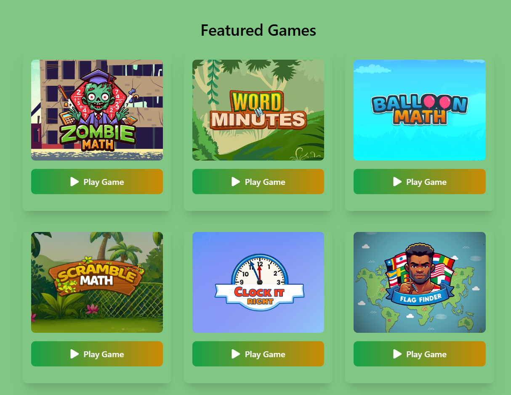
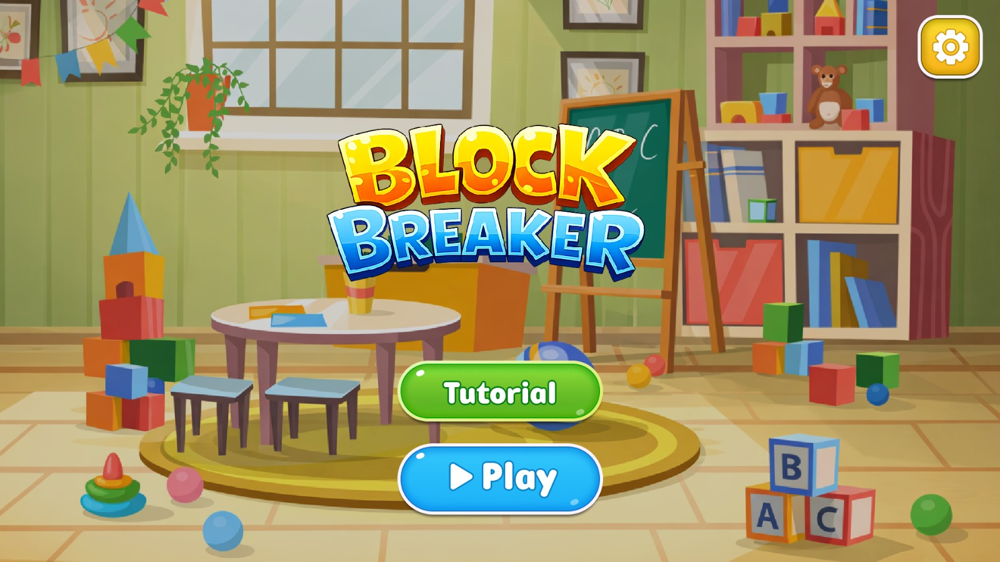
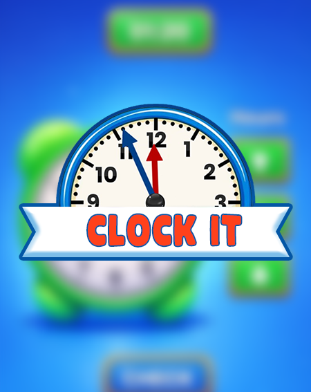

  

🎮 <b>Unity Game Developer | Gameplay Systems Engineer</b>  
 
💡 C# • WebGL • ScriptableObjects • AWS

  

### 🎮 **About Me**

I'm a **Unity Game Developer** with 3+ years of experience building and shipping 30+ interactive games, including 23+ production WebGL educational titles for a live learning platform.

I specialize in **gameplay systems architecture, modular C# design, and scalable WebGL deployment**, focusing on performance, reusability, and clean engineering practices.

- 🎮 Unity (2D & 3D) • C# • WebGL
- 🧩 ScriptableObjects • Game State Management • Progression Systems
- ☁️ Deployment: AWS (S3 + CloudFront), Vercel, Cloudflare
- 🌍 Currently building educational games at **EFG Games** (Konduct Coaching Learning LLC)
- 🎓 BS Computer Science (2026)

I enjoy designing systems that scale from prototype to production.

---

### 💼 **Professional Experience**

**Unity Game Developer** — Konduct Coaching Learning LLC (EFG Games), USA · Remote  
23+ production WebGL educational games: ScriptableObject-driven systems, progression/scoring/save-load, analytics, deployment (AWS, Vercel, Cloudflare).

---

### 🛠️ **Tech Stack & Tools**

| Category       | Technologies                                                                                                                                                                                                                                                                                                                                                                                                                                                                                                                                                                                                                |
| :------------- | :-------------------------------------------------------------------------------------------------------------------------------------------------------------------------------------------------------------------------------------------------------------------------------------------------------------------------------------------------------------------------------------------------------------------------------------------------------------------------------------------------------------------------------------------------------------------------------------------------------------------------- |
| **🎮 Engine**  |                                                                                                                                                                                                                                                                                                                |
| **🧩 Systems** |                                                          |
| **☁️ Deploy**  |     |
| **🔧 Tools**   |                                                                                                                                                  |

---

### 🚀 **Featured Projects**

<table>
  <tr>
    <td width="50%" align="center">
      
      <h3>📚 23+ Educational WebGL Games</h3>
      
<em>One shared codebase and ScriptableObject content pipeline power all 23+ titles, enabling non-engineers to author levels and reducing per-game integration time.</em>

      

        
        
        
      

      

        
      

    </td>
    <td width="50%" align="center">
      
      <h3>🧱 50-Level Block Breaker (WebGL)</h3>
      
<em>Designed with ScriptableObject-driven level configs so new levels and difficulty curves ship without code duplication.</em>

      

        
        
        
      

      

        
      

    </td>
  </tr>
  <tr>
    <td width="50%" align="center">
      
      <h3>🕐 Clock It — Analog Clock Learning (WebGL)</h3>
      
<em>Decoupled time-validation logic and ScriptableObject-driven question sets let the same clock system be reused across modules with zero code changes for new content.</em>

      

        
        
        
      

      

        
      

    </td>
    <td width="50%" align="center">
      
      <h3>🏗️ ML-Based 3D Defect Visualization</h3>
      
<em>Clear separation between ML inference and Unity: C# integration layer, config-driven marker placement, and event-driven updates for maintainability.</em>

      

        
        
        
      

      
<em>⚠️ Client NDA — demo & code unavailable</em>

    </td>
  </tr>
</table>

---

### 📈 **GitHub Stats & Activity**

  
  
  

  

  

---

### 🤝 **Let's Connect & Collaborate**

  
  
  

  
  
  
  

  

  
  **⭐ If you like my projects, consider giving them a star! ⭐**
  
  Made with ❤️ by [Muhammad Hasnain](https://mhasnain.me)
  

