

&nbsp;
&nbsp;

 

## ⚡ Quick look

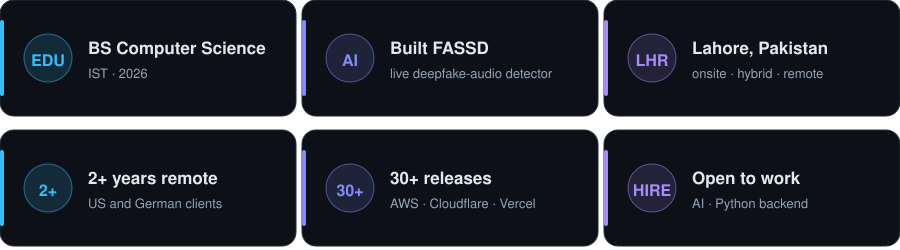

  

## 🔊 Spotlight: FASSD

**Forensic Acoustics for Synthetic Speech Detection.** Is a voice real, AI-generated, AI-spliced into a real recording, or an AI voice replayed through a speaker? My final year project; I owned the ML system end to end.

 

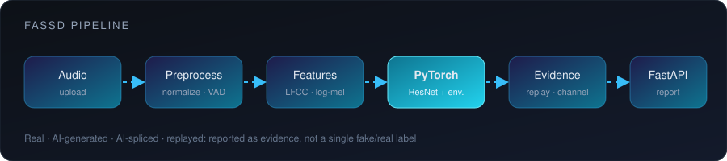

 

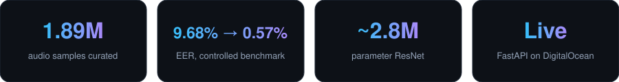

&nbsp;

  

## 💼 Experience

<a href="https://wisdom-island-webgl.vercel.app/">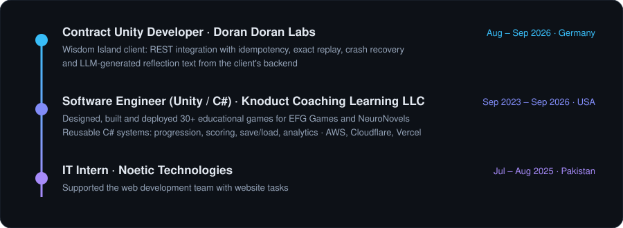</a>

  

## 🎮 Games I've shipped

<table align="center">
<tr>
<td align="center" width="33%"><a href="https://efg-blockbreaker-build.vercel.app/">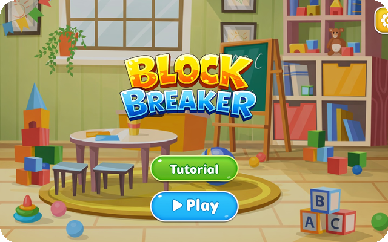</a> <b>Block Breaker</b> 50 data-driven levels</td>
<td align="center" width="33%"><a href="https://www.efggames.com/">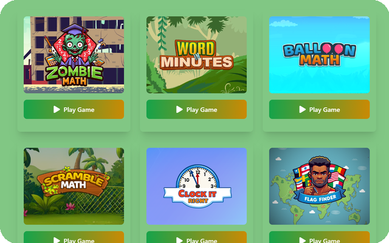</a> <b>EFG Games</b> 30+ live titles</td>
<td align="center" width="33%"> <b>Clock It Right</b> 4 learning modes</td>
</tr>
</table>

  

## ☁️ AWS labs

<a href="https://github.com/MHS-4ever/project-01-static-website-s3-cloudfront">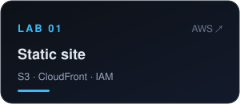</a>
<a href="https://github.com/MHS-4ever/project-02-ec2-linux-webserver">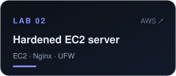</a>
<a href="https://github.com/MHS-4ever/project-03-aws-networking-vpc">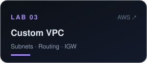</a>
<a href="https://github.com/MHS-4ever/project-04-dockerized-app">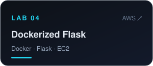</a>
 
<a href="https://github.com/MHS-4ever/project-05-cicd-flask-ec2">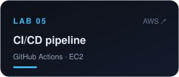</a>
<a href="https://github.com/MHS-4ever/project-06-terraform-aws">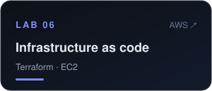</a>
<a href="https://github.com/MHS-4ever/project-07-multi-tier-aws">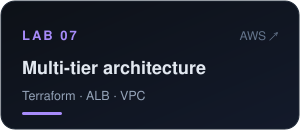</a>
<a href="https://github.com/MHS-4ever/project-08-serverless-api">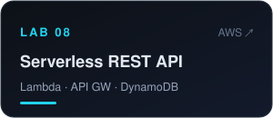</a>

  

## 🧰 Toolbox

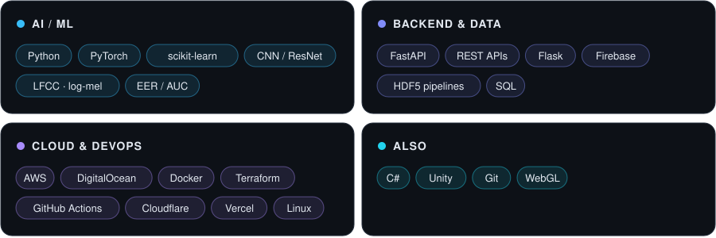

  

## 🐍 Activity

<picture>
  <source media="(prefers-color-scheme: dark)" srcset="https://raw.githubusercontent.com/MHS-4ever/MHS-4ever/output/github-contribution-grid-snake-dark.svg" />
  <source media="(prefers-color-scheme: light)" srcset="https://raw.githubusercontent.com/MHS-4ever/MHS-4ever/output/github-contribution-grid-snake.svg" />
  
</picture>

**Hiring for AI or Python backend work? I reply fast.**

&nbsp;
&nbsp;

